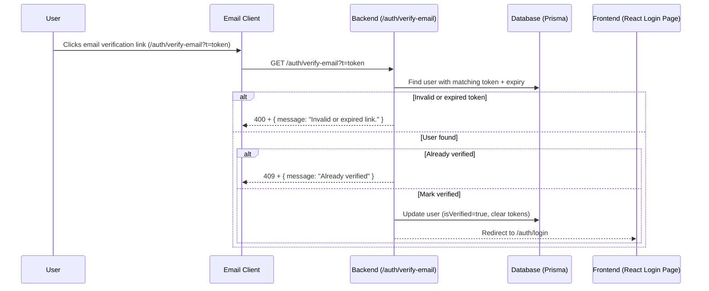

```mermaid
sequenceDiagram
  participant U as User
  participant E as Email Client
  participant B as Backend (/auth/verify-email)
  participant D as Database (Prisma)
  participant F as Frontend (React Login Page)

  U->>E: Clicks email verification link (/auth/verify-email?t=token)
  E->>B: GET /auth/verify-email?t=token
  B->>D: Find user with matching token + expiry
  alt Invalid or expired token
    B-->>E: 400 + { message: "Invalid or expired link." }
  else User found
    alt Already verified
      B-->>E: 409 + { message: "Already verified" }
    else Mark verified
      B->>D: Update user (isVerified=true, clear tokens)
      B-->>F: Redirect to /auth/login
    end
  end

```
