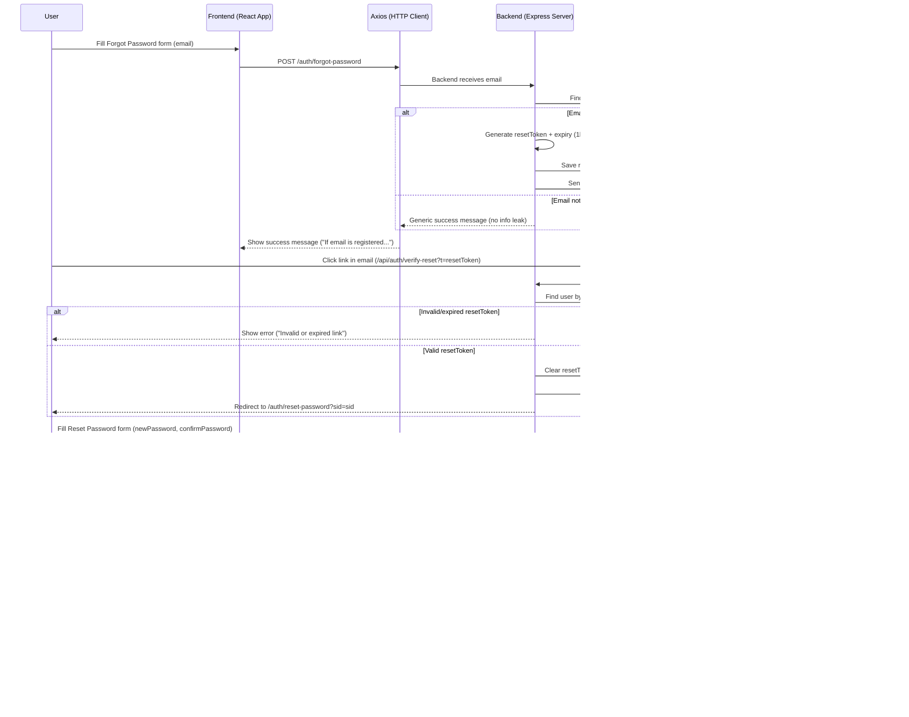

```mermaid
sequenceDiagram
  participant U as User
  participant F as Frontend (React App)
  participant A as Axios (HTTP Client)
  participant B as Backend (Express Server)
  participant D as Database (Prisma)
  participant E as Email Service (nodemailer)
  participant R as Redis (Session Store)

  %% --- Forgot Password Phase ---
  U->>F: Fill Forgot Password form (email)
  F->>A: POST /auth/forgot-password
  A->>B: Backend receives email
  B->>D: Find user by email
  alt Email exists
    B->>B: Generate resetToken + expiry (1h)
    B->>D: Save resetToken to user
    B->>E: Send email with /api/auth/verify-reset?t=resetToken
  else Email not found
    B-->>A: Generic success message (no info leak)
  end
  A-->>F: Show success message ("If email is registered...")

  %% --- User Clicks Email Link ---
  U->>E: Click link in email (/api/auth/verify-reset?t=resetToken)
  E->>B: GET /api/auth/verify-reset?t=resetToken
  B->>D: Find user by resetToken and expiry
  alt Invalid/expired resetToken
    B-->>U: Show error ("Invalid or expired link")
  else Valid resetToken
    B->>D: Clear resetToken + expiry from user
    B->>R: Save SESSION_RESET:sid = userId (1h)
    B-->>U: Redirect to /auth/reset-password?sid=sid
  end

  %% --- Reset Password Phase ---
  U->>F: Fill Reset Password form (newPassword, confirmPassword)
  F->>A: POST /auth/reset-password { sid, newPassword }
  A->>B: Backend receives sid and new password
  B->>R: Lookup SESSION_RESET:sid
  alt Invalid/expired sid
    B-->>A: 400 + "Reset session expired"
    A-->>F: Show error
  else Valid sid
    B->>B: Hash new password
    B->>D: Update user's password
    B->>R: Delete SESSION_RESET:sid (one-time use)
    B-->>A: Password reset success message
    A-->>F: Show success message and redirect to login
  end

```
