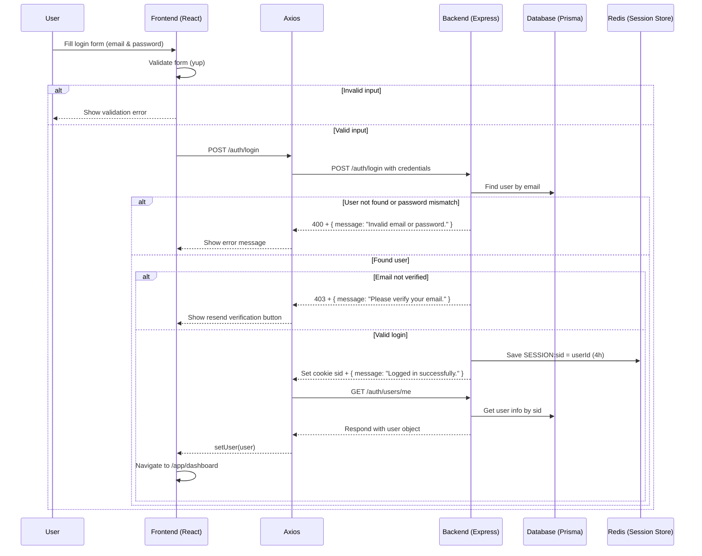

```mermaid
sequenceDiagram
  participant U as User
  participant F as Frontend (React)
  participant A as Axios
  participant B as Backend (Express)
  participant D as Database (Prisma)
  participant R as Redis (Session Store)

  U->>F: Fill login form (email & password)
  F->>F: Validate form (yup)
  alt Invalid input
    F-->>U: Show validation error
  else Valid input
    F->>A: POST /auth/login
    A->>B: POST /auth/login with credentials
    B->>D: Find user by email
    alt User not found or password mismatch
      B-->>A: 400 + { message: "Invalid email or password." }
      A-->>F: Show error message
    else Found user
      alt Email not verified
        B-->>A: 403 + { message: "Please verify your email." }
        A-->>F: Show resend verification button
      else Valid login
        B->>R: Save SESSION:sid = userId (4h)
        B-->>A: Set cookie sid + { message: "Logged in successfully." }
        A->>B: GET /auth/users/me
        B->>D: Get user info by sid
        B-->>A: Respond with user object
        A-->>F: setUser(user)
        F->>F: Navigate to /app/dashboard
      end
    end
  end
```
