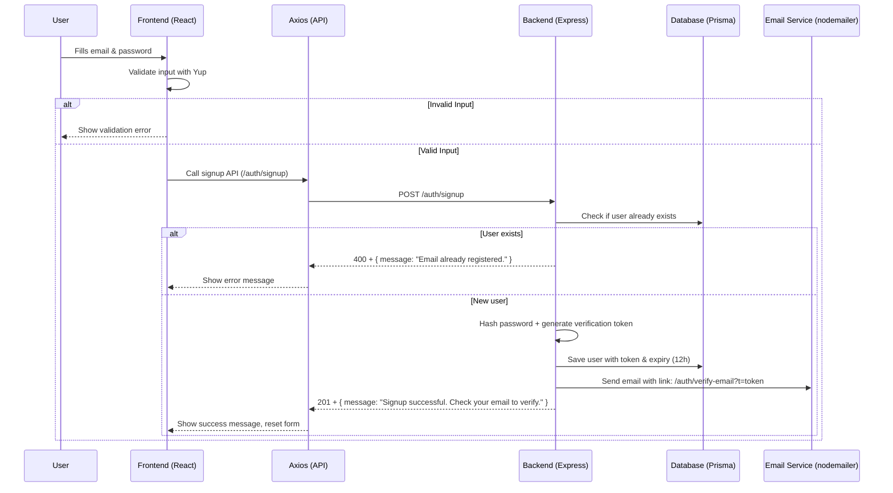

```mermaid
sequenceDiagram
  participant U as User
  participant F as Frontend (React)
  participant A as Axios (API)
  participant B as Backend (Express)
  participant D as Database (Prisma)
  participant E as Email Service (nodemailer)

  U->>F: Fills email & password
  F->>F: Validate input with Yup
  alt Invalid Input
    F-->>U: Show validation error
  else Valid Input
    F->>A: Call signup API (/auth/signup)
    A->>B: POST /auth/signup
    B->>D: Check if user already exists
    alt User exists
      B-->>A: 400 + { message: "Email already registered." }
      A-->>F: Show error message
    else New user
      B->>B: Hash password + generate verification token
      B->>D: Save user with token & expiry (12h)
      B->>E: Send email with link: /auth/verify-email?t=token
      B-->>A: 201 + { message: "Signup successful. Check your email to verify." }
      A-->>F: Show success message, reset form
    end
  end
```
